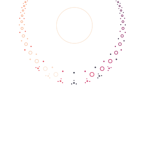

Apollonian Gasket
=================

The Apollonian Gasket is… well, it’s pretty, and Wikipedia does a good job at
explaining it. Here is the picture, and [here is the link to Wikipedia][wiki].
The short version is: if you have three circles, you can construct another
smaller circle that touches all of them. Do this recursively with some starting
geometry and you get this:

What’s nice about the Gasket is that you can also do it wrong, and it yields
other pretty pictures. Here I skipped the first generation, starting with three
not at all touching circles:

The prettiest variation on the classical gasket is if the initial circles have
some space between them; here the initial radius is 42 units, with 50 being the
»correct« value:

And here is a bug in the algoritm, which folds one part of the geometry
seemingly up into space (even though this is 100% 2D). The algorithm for this is
actually easier, with the Gasket requiring awkward special handling for one (!)
of its thousands of recursive steps.

[wiki]: https://en.wikipedia.org/wiki/Apollonian_gasket
