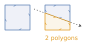

# Miscellaneous geometric operations

## Cutting lines


## Line intersections

A line (more precisely a line segment) is defined by a start and end point.
Therefore, two lines can intersect in different ways:

### Real intersection


The two lines intersect fully.

### Virtual intersection inside one of the lines:


One the lines intersects with the infinite continuation of the other.

### Virtual intersection


Only the infinite continuations of the lines intersect.

### Parallel lines


Parallel or collinear lines do not have a unique intersection point.

Note that there may be edge cases where two lines are meant to be parallel, but are not recognized as such because of numerical instability. E.g. these two lines:


```haskell
angledLine (Vec2 50 0) (rad (pi/6)) (Distance 80)
angledLine (Vec2 50 20) (rad (pi/6)) (Distance 80)
```

are obviously parallel, but still they have an intersection at (-2.1e17, -1.2e17).

## Mirroring

Mirror objects along a line.


## Cutting polygons

Cutting a square along a line is rather simple:



Of course, we keep the original square if the line misses:


Cutting a more complex polygon along a line is more complicate, especially if
the polygon is not convex. Each time we cut across a branch, we need to start a
new polygon:


Here's how exactly the cut works: We add new vertices, and two edges between the
new vertices. Then, we basically treat this edge graph as a directed graph, and
look for cycles. Each cycle in this edge graph is a resulting polygon.

This is how such an edge graph looks like (generated by hand):


And here's a similar edge graph, as an intermediate result from cutting a
square:


A nice and simple algorithm for a kind of shattering process is by randomly cutting a polygon in two pieces, and recursing for a number of steps.


## Convex hull

The convex hull of a point set is the smallest polygon that contains all of the
points.


